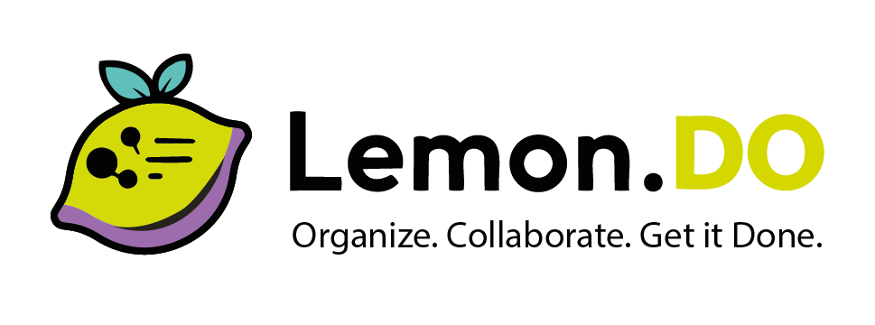

<p align="center">
  
</p>

<p align="center">
  A full-stack task management platform — consumer-grade UX meets enterprise-grade compliance.
</p>

<p align="center">
  <a href="https://lemondo.btas.dev"><strong>Live Demo</strong></a> &nbsp;&middot;&nbsp;
  <a href="https://api.lemondo.btas.dev/scalar/v1"><strong>API Docs</strong></a> &nbsp;&middot;&nbsp;
  <a href="./CHANGELOG.md"><strong>Changelog</strong></a>
</p>

<p align="center">
  <a href="https://github.com/btachinardi/lemon-todo/actions/workflows/deploy.yml"></a>
  <a href="https://github.com/btachinardi/lemon-todo/releases/tag/v1.0.0"></a>
  <a href="./LICENSE"></a>
</p>

---

## What is Lemon.DO?

Lemon.DO is a Kanban + list task manager built with **.NET 10 / Aspire 13** and **React 19 / Vite 7**. It follows **Domain-Driven Design** with five bounded contexts, strict layer boundaries, and test-driven development throughout.

**Highlights:**

- Kanban board with drag-and-drop, list view, filters, search, and task detail sheet
- JWT auth with HttpOnly cookie refresh, 3-tier RBAC (User / Admin / SystemAdmin)
- Admin panel with audit trail, protected data redaction, and break-the-glass reveal
- AES-256-GCM field encryption for emails, display names, and sensitive notes
- PWA with offline reads, mutation queue, and sync-on-reconnect
- Dark/light theme, i18n (English, Portuguese, Spanish), and guided onboarding
- In-app notifications + Web Push with due date reminders
- **854 tests** (397 backend + 361 frontend + 96 E2E) with property-based testing
- CI/CD via GitHub Actions, Docker, and Azure (Container Apps + Static Web App)

## Architecture

```
Domain  <-  Application  <-  Infrastructure  <-  Api  <-  AppHost
```

Five bounded contexts: **Tasks**, **Boards**, **Identity**, **Administration**, **Notifications**. Cross-context coordination at the Application layer. Pure domain with zero external dependencies.

## Tech Stack

| | Technology |
|-|------------|
| **Backend** | .NET 10, ASP.NET Core, EF Core 10, Aspire 13 |
| **Frontend** | React 19, TypeScript 5.9, Vite 7, Tailwind 4, Shadcn/ui |
| **State** | TanStack Query 5 (server) + Zustand 5 (client) |
| **Database** | SQLite (dev) / Azure SQL (prod) |
| **Testing** | MSTest 4, FsCheck 3, Vitest, fast-check, Playwright |
| **Infra** | Terraform (10 modules), GitHub Actions, Docker, Azure |
| **Observability** | OpenTelemetry + Serilog via Aspire Dashboard |

## Getting Started

```bash
git clone https://github.com/btachinardi/lemon-todo.git
cd lemon-todo
cd src/client && pnpm install && cd ../..
./dev start
```

See the **[Development Guide](./docs/DEVELOPMENT.md)** for CLI reference, test accounts, SQL Server setup, and migrations.

## Project Structure

```
src/
├── LemonDo.AppHost/          # Aspire orchestrator
├── LemonDo.Api/              # Minimal API (30+ endpoints)
├── LemonDo.Application/      # Commands + Queries (CQRS)
├── LemonDo.Domain/           # Entities, value objects, events
├── LemonDo.Infrastructure/   # EF Core, Identity, encryption
├── LemonDo.Migrations.*/     # SQLite + SQL Server migrations
└── client/                   # React frontend
tests/
├── LemonDo.*.Tests/          # Backend tests (3 projects)
└── e2e/                      # Playwright E2E
infra/                        # Terraform (3 stages, 10 modules)
```

## Release History

| Version | Milestone | Tests |
|---------|-----------|-------|
| [v1.0.0](https://github.com/btachinardi/lemon-todo/releases/tag/v1.0.0) | PWA, offline, onboarding, notifications, analytics, landing page | 854 |
| [v0.4.0](https://github.com/btachinardi/lemon-todo/releases/tag/v0.4.0) | Observability, admin panel, encryption, i18n, Azure deploy | 668 |
| [v0.3.0](https://github.com/btachinardi/lemon-todo/releases/tag/v0.3.0) | Dark mode, filters, task detail sheet, E2E | 478 |
| [v0.2.0](https://github.com/btachinardi/lemon-todo/releases/tag/v0.2.0) | Auth, RBAC, cookie refresh, user-scoped data | 388 |
| [v0.1.0](https://github.com/btachinardi/lemon-todo/releases/tag/v0.1.0) | DDD domain, Kanban board, list view, 18 endpoints | 242 |

## Documentation

| | |
|-|-|
| [Development Guide](./docs/DEVELOPMENT.md) | CLI, test accounts, SQL Server, troubleshooting |
| [Deployment Guide](./docs/DEPLOYMENT.md) | CI/CD, Azure infrastructure, Docker |
| [Domain Model](./docs/DOMAIN.md) | Bounded contexts, entities, value objects |
| [Product Requirements](./docs/PRD.md) | PRD with user stories |
| [Development Journal](./docs/JOURNAL.md) | Decisions, phases, lessons learned |
| [Guidelines](./GUIDELINES.md) | TDD, DDD, code quality, git workflow |
| [Roadmap](./docs/ROADMAP.md) | Future capability tiers |

## License

[MIT](./LICENSE)
