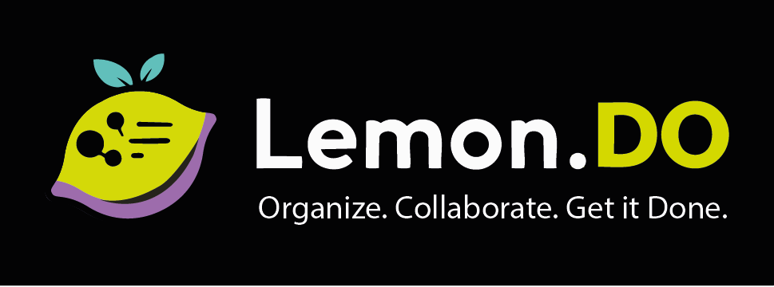

<p align="center">
  
</p>

<p align="center">
  A full-stack task management platform — consumer-grade UX meets enterprise-grade compliance.
</p>

<p align="center">
  <a href="https://lemondo.btas.dev"><strong>Live Demo</strong></a> &nbsp;&middot;&nbsp;
  <a href="https://lemondo.btas.dev/methodology"><strong>Methodology</strong></a> &nbsp;&middot;&nbsp;
  <a href="https://api.lemondo.btas.dev/scalar/v1"><strong>API Docs</strong></a> &nbsp;&middot;&nbsp;
  <a href="./CHANGELOG.md"><strong>Changelog</strong></a>
</p>

<p align="center">
  <a href="https://github.com/btachinardi/lemon-todo/actions/workflows/deploy.yml"></a>
  <a href="https://github.com/btachinardi/lemon-todo/releases/tag/v1.0.1"></a>
  <a href="./LICENSE"></a>
</p>

---

## About this Assignment

Hello there! I'm Bruno Tachinardi and this is my **lemon.io take-home assignment** for the Full Stack Developer position, I know you are a healthcare startup that **detects early-stage cancers across multiple organs through a single MRI scan** (that's incredible!) and I can't wait to meet you.

The assignment asked for a todo/task management app with .NET/SQLite on the backend, React on the frontend, and "any features you would add for a real production MVP."

The feature scope was driven by your company's domain. A production MVP in regulated healthcare is not just working code — it means HIPAA-aware data protection, offline reliability for unstable hospital networks, Azure deployment (to match your stack), immutable audit trails for compliance, and product analytics to validate hypotheses (as we should in a real MVP).

Every feature traces back to this reasoning. The branding itself is intentional: named after lemon.io to demonstrate the ability to adapt frontend design to any brand guidelines.

The project was built from an empty folder, with **5 planning documents created before any code**, delivered across **5 incremental checkpoints** (each a complete, shippable application), backed by **1,034 tests**, and **deployed to Azure** with Terraform IaC. See the [Methodology page](https://lemondo.btas.dev/methodology) for the full rationale and journey.

I get really invested in all projects I work on, and I couldn't help myself even though this was only a take-home assignment; everything was built as if this were a real product I wanted to see succeed in the market. I hope you like it!

## What is Lemon.DO?

Lemon.DO is a Kanban + list task manager built with **.NET 10 / Aspire 13** and **React 19 / Vite 7**. It follows **Domain-Driven Design** with five bounded contexts, strict layer boundaries, and test-driven development throughout.

**Highlights:**

- Kanban board with drag-and-drop, list view, filters, search, and task detail sheet
- JWT auth with HttpOnly cookie refresh, 3-tier RBAC (User / Admin / SystemAdmin)
- Admin panel with audit trail, protected data redaction, and break-the-glass reveal
- AES-256-GCM field encryption for emails, display names, and sensitive notes
- PWA with offline reads, mutation queue, and sync-on-reconnect
- Dark/light theme, i18n (English, Portuguese, Spanish), and guided onboarding
- In-app notifications + Web Push with due date reminders
- **1,034 tests** (413 backend + 469 frontend + 152 E2E) — property-based invariants, 26 visual regression baselines, WCAG contrast coverage, dual-database CI, and enum translation guards generated from the OpenAPI spec
- CI/CD via GitHub Actions, Docker, and Azure (Container Apps + Static Web App)

## Architecture

```
Domain  <-  Application  <-  Infrastructure  <-  Api  <-  AppHost
```

Five bounded contexts: **Tasks**, **Boards**, **Identity**, **Administration**, **Notifications**. Cross-context coordination at the Application layer. Pure domain with zero external dependencies.

## Development Process

Built from an empty folder with 5 planning documents before any code — PRD, technology research, user scenarios, domain model, and development guidelines. Delivered in 5 incremental checkpoints, each producing a complete, shippable application. Every checkpoint is tagged and runnable (`git checkout v0.1.0 && ./dev start`).

Three architectural problems were identified and redesigned mid-build rather than patched: the Column-Status invariant (eliminating sync bugs), a Bounded Context split (separating Task and Board aggregates across 98 files), and the Card Ordering system (sparse decimal ranks with a neighbor-based API contract). Each redesign is documented in the [Development Journal](./docs/JOURNAL.md).

Testing strategy includes property-based testing on both stacks (FsCheck + fast-check), dual-database CI (SQLite + SQL Server in parallel), 26 visual regression baselines, WCAG contrast testing, E2E with per-test data isolation, and OpenAPI-generated enum guards with translation coverage.

See the [Methodology page](https://lemondo.btas.dev/methodology) for the full story, or browse the [Trade-offs](./docs/TRADEOFFS.md) for every deliberate decision.

## Tech Stack

| | Technology |
|-|------------|
| **Backend** | .NET 10, ASP.NET Core, EF Core 10, Aspire 13 |
| **Frontend** | React 19, TypeScript 5.9, Vite 7, Tailwind 4, Shadcn/ui |
| **State** | TanStack Query 5 (server) + Zustand 5 (client) |
| **Database** | SQLite (dev) / Azure SQL (prod) |
| **Testing** | MSTest 4, FsCheck 3, Vitest, fast-check, Playwright |
| **Infra** | Terraform (10 modules), GitHub Actions, Docker, Azure |
| **Observability** | OpenTelemetry + Serilog via Aspire Dashboard |

## Getting Started

```bash
git clone https://github.com/btachinardi/lemon-todo.git
cd lemon-todo
./dev install
./dev start
```

See the **[Development Guide](./docs/DEVELOPMENT.md)** for CLI reference, test accounts, SQL Server setup, and migrations.

## Project Structure

```
src/
├── LemonDo.AppHost/          # Aspire orchestrator
├── LemonDo.Api/              # Minimal API (30+ endpoints)
├── LemonDo.Application/      # Commands + Queries (CQRS)
├── LemonDo.Domain/           # Entities, value objects, events
├── LemonDo.Infrastructure/   # EF Core, Identity, encryption
├── LemonDo.Migrations.*/     # SQLite + SQL Server migrations
└── client/                   # React frontend
tests/
├── LemonDo.*.Tests/          # Backend tests (3 projects)
└── e2e/                      # Playwright E2E
infra/                        # Terraform (3 stages, 10 modules)
```

## Release History

| Version | Milestone | Tests |
|---------|-----------|-------|
| Unreleased | Admin E2E, OpenAPI type generation, offline queue, enum translation guards | 1,034 |
| [v1.0.1](https://github.com/btachinardi/lemon-todo/releases/tag/v1.0.1) | Mobile, accessibility & CI bug fixes | 908 |
| [v1.0.0](https://github.com/btachinardi/lemon-todo/releases/tag/v1.0.0) | PWA, offline, onboarding, notifications, analytics, landing page | 854 |
| [v0.4.0](https://github.com/btachinardi/lemon-todo/releases/tag/v0.4.0) | Observability, admin panel, encryption, i18n, Azure deploy | 668 |
| [v0.3.0](https://github.com/btachinardi/lemon-todo/releases/tag/v0.3.0) | Dark mode, filters, task detail sheet, E2E | 478 |
| [v0.2.0](https://github.com/btachinardi/lemon-todo/releases/tag/v0.2.0) | Auth, RBAC, cookie refresh, user-scoped data | 388 |
| [v0.1.0](https://github.com/btachinardi/lemon-todo/releases/tag/v0.1.0) | DDD domain, Kanban board, list view, 18 endpoints | 242 |

## Documentation

| | |
|-|-|
| [Development Journal](./docs/JOURNAL.md) | Complete build narrative — every decision, phase, and lesson |
| [Trade-offs](./docs/TRADEOFFS.md) | Every deliberate trade-off with alternatives and rationale |
| [Development Guide](./docs/DEVELOPMENT.md) | CLI, test accounts, SQL Server, troubleshooting |
| [Deployment Guide](./docs/DEPLOYMENT.md) | CI/CD, Azure infrastructure, Docker |
| [Domain Model](./docs/DOMAIN.md) | Bounded contexts, entities, value objects |
| [Product Requirements](./docs/PRD.md) | PRD with user stories and scenarios |
| [User Scenarios](./docs/SCENARIOS.md) | 3 personas, 10 storyboards, UX decisions |
| [Guidelines](./GUIDELINES.md) | TDD, DDD, code quality, git workflow |
| [Roadmap](./docs/ROADMAP.md) | 9 future capability tiers |

## License

[MIT](./LICENSE)
